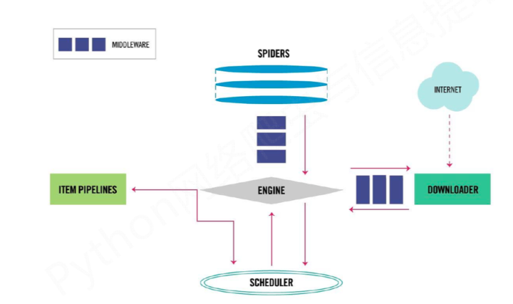

## This is a super easy demo of scrapy framework

This demo just scrapes the name of the first item on zimuku.net

-------
### A simple overview of scrapy framework

The picture clearly illustrates five parts of scrapy framework.

* SPIDERS

需要手动实现的核心部分。最主要的功能是解析网页内容、产生爬取项

* ITEM PIPELINES

将爬取筛选完毕的数据写入文本，数据库等。

* DOWNLOADER

从网页上获取网页内容

* SCHEDULER

对所有的爬取进行请求，进行调度管理，管过简单配置可以达到更加多线程，并发处理等功能

* ENGINE

整个框架的控制中心，控制着所有模块的数据流交流